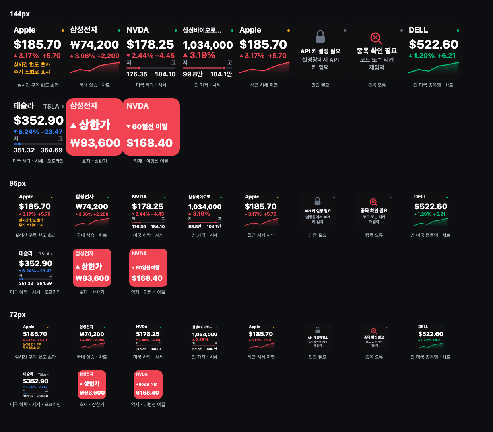

# TossInvest for Stream Deck

토스증권 Open API로 국내·미국 주식의 현재가를 Stream Deck 키에서 확인하는 비공식 플러그인입니다.

> 이 플러그인은 토스증권이 제공·보증하는 공식 제품이 아닙니다. 표시되는 데이터는 지연되거나 일시적으로 비어 있을 수 있으며 투자 권유가 아닙니다.



**처음 보신다면 [기능 화면 안내](docs/product-overview.ko.md)를 먼저 확인하세요.** 실제 설정 패널과 키 카드, 시그널 화면, 시세가 키에 표시되기까지의 흐름을 그림으로 설명합니다.

## 제공 기능

- 국내 종목코드(`005930`)와 미국 티커(`AAPL`) 입력
- 종목명·통화·시장 자동 확인
- 현재가와 직전 거래일 일봉 종가 대비 등락액·등락률 표시 (72px 키에서도 읽히도록 큰 글자, 긴 값은 자동 축약)
- 공식 WebSocket 체결 스트림 기반 실시간 모드와 1초 절약형 모드
- 키별 `즉시 새로고침`, `화면 모드 전환`, `토스증권 종목 열기`, `동작 없음`
- 같은 종목을 여러 키에 배치해도 API 구독은 하나로 공유
- 시그널 화면: 등락률 5% 단위 돌파, 국내 상·하한가, 20·60·120일선 돌파/이탈이 발생하면 키가 잠시 종목명·시그널 이름·가격을 크게 보여주는 화면으로 바뀝니다. 호재/악재에 따라 배경색이 달라지며, 표시 시간은 전역 설정에서 3/5/10초 중 선택합니다(기본 5초). 키를 누르면 바로 닫힙니다. 구독 중 새로 발생한 변화만 알리며, 같은 시그널은 거래일당 1회만 표시합니다.

계좌·보유자산·주문·조건주문은 의도적으로 제공하지 않습니다.

## 준비

1. 토스증권 WTS에서 **설정 → Open API**로 Client ID와 Client Secret을 발급합니다.
2. 같은 화면의 **허용 IP 관리**에 플러그인이 실행될 컴퓨터의 공인 IP를 등록합니다.
3. [토스증권 Open API 문서](https://developers.tossinvest.com/docs)를 확인합니다.
4. Stream Deck 6.9 이상과 Node.js 20 런타임이 필요합니다. macOS 13 이상 또는 Windows 10 이상을 지원합니다.

## 설치

`dist/com.saybgm.tossinvest.streamDeckPlugin`을 다운로드한 뒤 더블클릭해 Stream Deck에 설치합니다. GitHub Release에는 같은 파일과 `SHA256SUMS`가 함께 제공됩니다.

현재 개발 환경에서 패키지 생성은 다음으로 수행합니다.

```sh
npm install
npx playwright install chromium
npm run verify:all
npm run package:plugin
npm run package:smoke
```

## 설정

플러그인을 추가한 뒤 Property Inspector에서 Client ID/Secret을 입력하고 **저장 및 연결 확인**을 누릅니다. 공식 OAuth 인증이 성공한 경우에만 자격증명을 저장하고 종목 설정 단계를 엽니다. 자격증명은 이 컴퓨터의 Stream Deck 설정에 저장되며 OS 보안 저장소를 사용하지 않습니다. 실제 값을 저장소, 이슈, 로그, 화면 녹화, CI 변수에 올리지 마세요.

각 키의 종목 코드에 `005930` 또는 `AAPL`을 입력하고 **종목 확인**을 누르면 종목명·시장·통화가 저장됩니다. 미국 종목의 토스증권 열기 URL은 티커 경로를 사용하며 토스 웹이 내부 상품 코드로 리다이렉트합니다.

화면 갱신 주기와 시그널 표시 시간은 별도 **표시 설정**에서 변경합니다. **표시 설정 저장**은 자격증명을 변경하거나 OAuth 인증을 다시 요청하지 않습니다. 종목 확인 여부와 시세 서버의 연결 상태는 따로 표시됩니다.

## 데이터 동작

- 시작·종목 변경·수동 새로고침: `/api/v1/stocks`, `/api/v1/prices`, 조정 일봉 `/api/v1/candles`(이동평균 계산을 위해 130개)를 호출합니다.
- 국내 종목은 `/api/v1/price-limits`로 상·하한가를 하루 1회(첫 로드·거래일 변경 시) 조회합니다. 미국 종목은 상·하한가가 없어 호출하지 않습니다.
- 연결 후: `trade:kr` 또는 `trade:us` 체결 WebSocket을 구독합니다.
- 체결 수신: 현재가와 미니 차트의 마지막 점, 당일 고가·저가를 즉시 갱신하고 시그널 조건을 평가합니다. WebSocket이 끊기면 키의 상태 점이 회색으로 바뀌고 REST 폴백으로 갱신합니다.
- WebSocket 단절: 최대 100개 종목을 한 번에 묶어 REST 폴백을 시도하고 지수 백오프로 재연결합니다.
- 화면 갱신: 모든 체결을 메모리의 최신 상태에 반영하지만 Stream Deck `setImage` 호출은 전역 큐에서 합쳐 초당 10회 이하로 제한합니다.

- 연결 정체: 핸드셰이크는 15초까지 기다립니다. 60초마다 텍스트 `PING`을 보내고 JSON `pong` 응답이 15초 안에 없으면 해당 소켓을 정리하고 재연결합니다. 거래 틱이 없는 것만으로 연결을 끊지 않습니다.
- 구독 한도: 중복을 제외한 100종목까지 실시간으로 구독합니다. 초과 종목은 REST 시세와 한도 안내를 표시하며, 다른 종목 키를 제거해 자리가 생기면 자동으로 복구됩니다. REST 요청도 API 상한에 맞춰 나눕니다.
- 외부 데이터: 사용하는 응답 필드를 검증합니다. 종목·시세 목록의 잘못된 항목은 정상 항목과 분리하고, 손상된 일봉은 이동평균에 섞지 않습니다.

명세 확인일: **2026-09-08**. [공식 OpenAPI](https://openapi.tossinvest.com/openapi-docs/latest/openapi.json)와 [공식 AsyncAPI](https://openapi.tossinvest.com/openapi-docs/latest/asyncapi.json)를 기준으로 검증·연결 감시를 구현했습니다.

## 개발 경계

이 저장소의 자동 테스트는 모의 REST/WebSocket과 카드 렌더링을 검증합니다. 실제 토스 인증, 허용 IP, 국내·미국 장중 체결, 절전 복귀는 사용자의 자격증명과 실제 Stream Deck 호스트에서 별도 검증해야 합니다. 실제 자격증명은 테스트 픽스처로 커밋하지 않습니다.

## GitHub Actions

- `CI`: push/PR마다 macOS와 Windows에서 타입 검사·단위 테스트·빌드·패키지 스모크를 실행하고, Ubuntu Chromium에서 PI Flow와 72/96/144px 시각 스냅샷을 별도로 검증합니다.
- `Release`: `v*` 태그 push 시 단위·브라우저 검증, 패키징, SHA-256 확인 후 GitHub Release에 설치 패키지와 체크섬을 업로드합니다.

## 라이선스

MIT. 토스증권의 상표·로고 권리는 각 권리자에게 있습니다.
