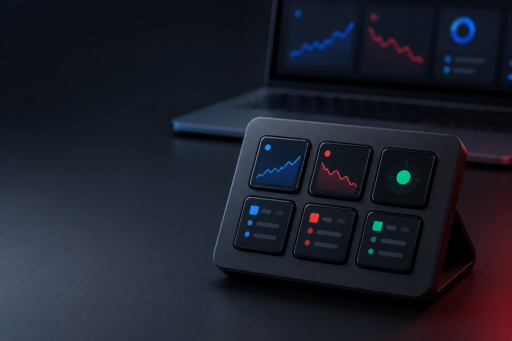
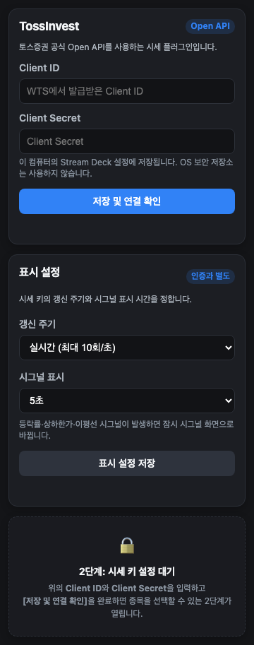
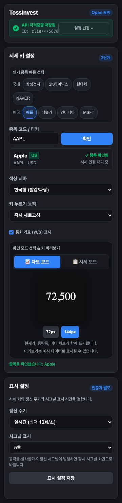
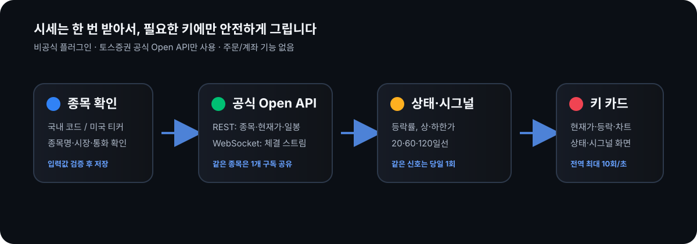

# TossInvest for Stream Deck: 기능 안내

TossInvest for Stream Deck는 토스증권 **공식 Open API**로 국내·미국 주식의 현재가를 Stream Deck 키에서 빠르게 확인하는 비공식 플러그인입니다. 이 문서는 설치 전에 무엇을 볼 수 있고 어떻게 동작하는지 한눈에 이해하도록 만든 기능 안내입니다.

> 위 이미지는 제품 성격을 설명하기 위한 일러스트입니다. 아래의 설정 패널과 키 카드는 프로젝트의 브라우저 시각 테스트에서 생성한 실제 UI 스냅샷입니다.

## 한눈에 보기

| 원하는 일 | 플러그인이 하는 일 |
| --- | --- |
| 자주 보는 종목 확인 | 국내 6자리 코드 또는 미국 티커로 종목명·시장·통화를 확인합니다. |
| 한 번에 시세 읽기 | 현재가, 직전 거래일 종가 대비 등락액·등락률, 미니 차트를 키에 표시합니다. |
| 변화 감지 | ±5% 단위, 국내 상·하한가, 20·60·120일선 돌파·이탈을 키 화면으로 알립니다. |
| 여러 키 관리 | 같은 종목을 여러 키에 두어도 WebSocket 구독은 하나로 공유합니다. |

계좌, 보유자산, 주문, 조건주문은 제공하지 않습니다. 이 프로젝트의 범위는 **시세 조회**입니다.

## 1. 먼저 API를 연결합니다

Property Inspector에서 토스증권 WTS로 발급받은 Client ID와 Client Secret을 입력한 뒤 `저장 및 연결 확인`을 누릅니다. 연결이 성공해야 종목 설정 단계가 열립니다.

- 화면 갱신 주기는 실시간(전체 키 합산 최대 초당 10회) 또는 1초 절약형 중에서 고릅니다.
- 시그널 화면은 3초, 5초, 10초 중에서 선택하며 키를 누르면 즉시 닫을 수 있습니다.
- 화면 갱신 주기와 시그널 표시 시간은 별도 **표시 설정**에서 저장합니다. 이미 저장된 자격증명을 다시 인증할 필요가 없습니다.
- 자격증명은 Stream Deck의 이 컴퓨터 설정에 저장됩니다. 저장소, 로그, 화면 공유에 실제 값을 넣지 않아야 합니다.

## 2. 종목 하나를 키 하나에 연결합니다

연결 후에는 `005930`처럼 국내 종목 코드를, 또는 `AAPL`처럼 미국 티커를 입력해 종목을 확인합니다. 플러그인은 공식 종목 조회 결과로 이름·시장·통화를 확인한 종목만 저장하고 구독합니다.

키를 눌렀을 때의 동작도 종목별로 고를 수 있습니다.

- 즉시 새로고침
- 화면 모드 전환(차트 ↔ 시세)
- 토스증권 웹에서 해당 종목 열기
- 동작 없음

## 3. 키에서는 가격과 상태를 함께 읽습니다

카드는 72px, 96px, 144px 키 크기에 맞춰 글자와 정보를 조정합니다. 일반 화면에서는 종목명, 현재가, 등락, 미니 차트와 고가·저가를 보여주며, 다음처럼 필요한 상태도 별도로 알려줍니다.

- API 키 설정 필요, 종목 확인 필요 같은 설정 안내
- 일시적인 시세 지연, 오프라인/재연결 상태
- 긴 종목명·큰 가격을 잘리지 않게 줄인 표시
- 한국형(상승 빨강/하락 파랑) 또는 글로벌형(상승 초록/하락 빨강) 색상 테마

## 4. 눈에 띄는 변화는 잠시 시그널 화면으로 바뀝니다

빨간 시그널 카드가 그 예입니다. 상승 조건에는 상승 색, 하락 조건에는 하락 색을 사용해 종목명·시그널 이름·가격을 크게 보여줍니다. 가격 변화에 따른 알림이며 기업 뉴스나 호재·악재를 분석하는 기능은 아닙니다.

| 감지 대상 | 표시 조건 |
| --- | --- |
| 등락률 | ±5% 단위 변화 |
| 국내 상·하한가 | 당일 상한가 또는 하한가 도달 |
| 이동평균선 | 20·60·120일선 돌파 또는 이탈 |

처음 구독한 값은 기준을 잡는 데만 쓰며, 그 뒤 새로 발생한 변화만 표시합니다. 같은 레벨·방향의 시그널은 거래일마다 한 번만 나타납니다.

## 데이터가 키에 닿는 과정

시작·종목 변경·수동 새로고침 때는 REST로 종목 정보, 현재가, 조정 일봉을 가져옵니다. 연결 후에는 체결 WebSocket으로 최신 가격을 반영합니다. 연결이 끊기면 REST 갱신과 재연결을 시도하고, 모든 체결을 바로 화면에 보내지는 않습니다. 최신 상태를 합쳐 전역 렌더 큐에서 제한된 횟수로만 그려 여러 키를 안정적으로 갱신합니다.

## 시작 전 확인할 것

1. 토스증권 WTS의 **설정 → Open API**에서 Client ID와 Client Secret을 발급합니다.
2. **허용 IP 관리**에 플러그인을 실행할 컴퓨터의 공인 IP를 등록합니다.
3. Stream Deck 6.9 이상과 Node.js 20 런타임을 준비합니다.
4. 설치 파일을 Stream Deck에 설치한 뒤, Property Inspector에서 연결 확인과 종목 확인을 차례로 마칩니다.

실제 토스 인증, 장중 체결, 절전 복귀는 개인 자격증명과 실제 Stream Deck 장비가 필요한 별도 확인 항목입니다. 이 문서의 화면은 그러한 실서비스 연결을 주장하지 않는 로컬 시각 테스트 결과입니다.

## 더 보기

- 설치·개발·패키징 방법: [README](../README.md)
- 지원 API와 제한: [토스증권 Open API 문서](https://developers.tossinvest.com/docs)
